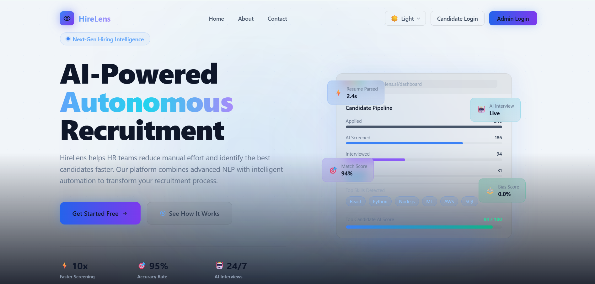
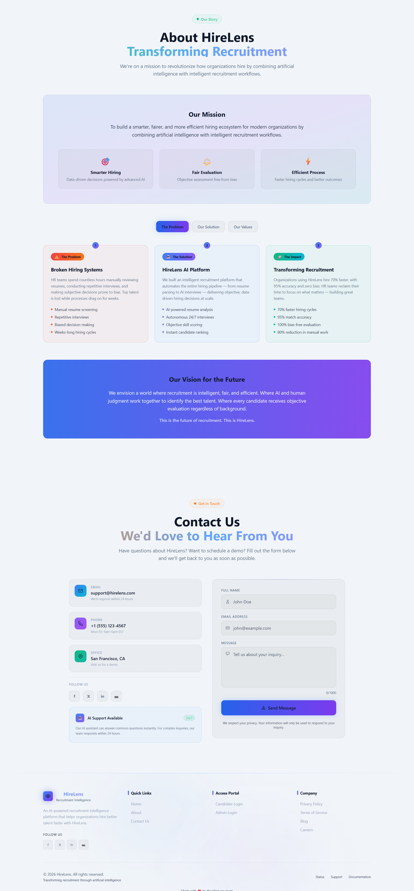
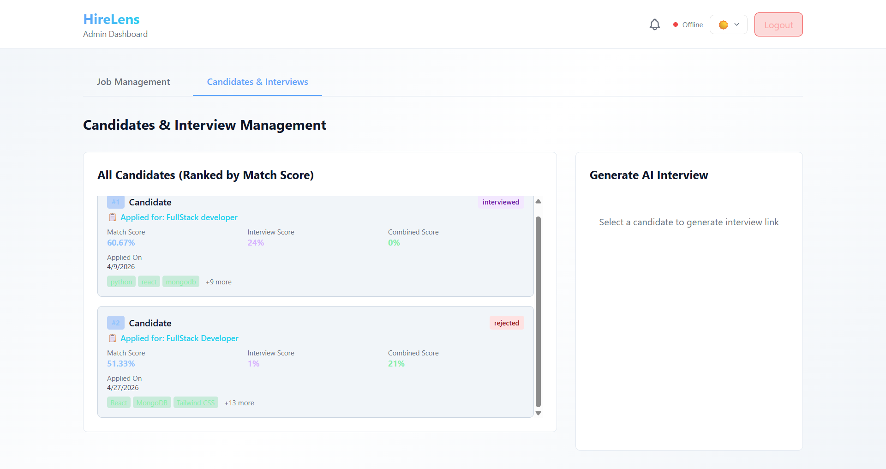
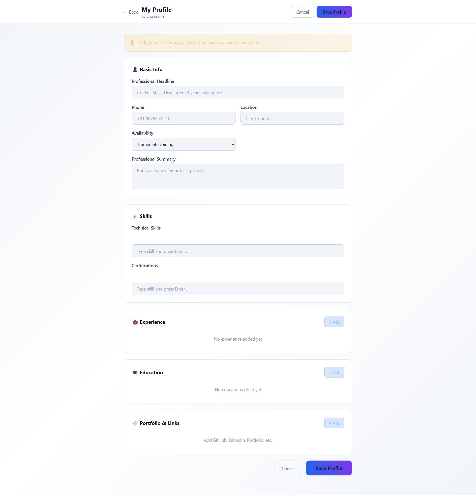

# HireLens

AI-powered recruitment platform that turns raw resumes into ranked, interview-ready candidates.

HireLens lets candidates apply to jobs with a resume, automatically parses and scores that resume against the job description using LLMs, promotes strong matches to an AI-driven screening interview, and pushes live results to the recruiter's dashboard.

- **Live app:** https://hirelens0.vercel.app
- **Live API:** https://hirelens-t23q.onrender.com/api/health

---

## Table of Contents

- [Features](#features)
- [Screenshots](#screenshots)
- [Tech Stack](#tech-stack)
- [Architecture](#architecture)
- [Project Structure](#project-structure)
- [Getting Started](#getting-started)
- [Environment Variables](#environment-variables)
- [Running the App](#running-the-app)
- [API Reference](#api-reference)
- [Data Models](#data-models)
- [Real-Time Notifications](#real-time-notifications)
- [Candidate Pipeline](#candidate-pipeline)
- [Deployment](#deployment)
- [Troubleshooting](#troubleshooting)
- [Additional Docs](#additional-docs)
- [Contributing](#contributing)

---

## Features

**For candidates**
- Register / log in as a candidate (JWT auth) and build a structured profile (skills, experience, education, portfolio links).
- Apply to jobs by uploading a resume (PDF / DOCX / TXT); the text is extracted server-side.
- AI resume parsing extracts name, contact details, summary, skills, experience and education.
- Instant match score against the job, with matched skills, missing skills and a skill-gap breakdown.
- Job recommendations sourced from your resume skills (internal postings + external listings via JSearch).
- Automated AI interview via an emailed, tokenized link — questions are generated from the job role and your skills, answers are scored and given feedback.
- Application tracking dashboard with status updates (`applied → screening → interview → hired / rejected`) and email notifications at each stage.

**For recruiters / admins**
- Post and manage job openings (title, description, required skills, experience, salary, location, vacancies).
- See every applicant per job, ranked by AI match score with strengths, concerns and an overall assessment.
- Trigger AI interview invites in one click; candidates receive a branded email with a unique interview link.
- Live dashboard updates over Socket.io the moment a candidate finishes an interview.
- Radar-chart visualisation of candidate fit across skills, semantic similarity, experience, education and project relevance.
- Manual status overrides plus automatic threshold-based progression.

---

## Screenshots

| Home | About |
| --- | --- |
|  |  |

| Candidate Dashboard | My Applications |
| --- | --- |
|  |  |

| Recruiter Dashboard | Screening |
| --- | --- |
|  |  |

| Job Recommendations | Profile |
| --- | --- |
|  |  |

---

## Tech Stack

| Layer | Technology |
| --- | --- |
| Frontend | React 18, Vite 5, React Router 6, Tailwind CSS 3, Axios, socket.io-client |
| Backend | Node.js, Express 4 (ESM), Mongoose 7, Socket.io 4, Multer, JWT, bcryptjs |
| Database | MongoDB (Atlas or local) |
| AI | Google Gemini (`@google/generative-ai`) with OpenAI as fallback |
| Parsing | `pdf-parse` (PDF), `mammoth` (DOCX), plain-text reader |
| Email | Nodemailer (Gmail SMTP / app password) |
| External jobs | JSearch API via RapidAPI |
| Hosting | Vercel (client), Render (server), MongoDB Atlas (database) |
| Optional service | FastAPI + SQLAlchemy standalone interview prototype (`server/AI Inter`) |

---

## Architecture

```
┌──────────────────────┐       REST (axios)        ┌──────────────────────┐
│  React client (Vite) │ ────────────────────────► │  Express API server  │
│  Tailwind, Router    │ ◄──────────────────────── │  JWT auth, Multer    │
└──────────┬───────────┘       Socket.io           └──────────┬───────────┘
           │  live "interview-completed" events               │
           │                                                  │
           │                              ┌───────────────────┼───────────────────┐
           │                              ▼                   ▼                   ▼
           │                       ┌────────────┐     ┌──────────────┐    ┌──────────────┐
           │                       │  MongoDB   │     │ Gemini/OpenAI│    │  Nodemailer  │
           │                       │  (Atlas)   │     │  resume +    │    │  status &    │
           │                       └────────────┘     │  interview AI│    │ invite mails │
           │                                          └──────────────┘    └──────────────┘
           │                                                  ▲
           └───────────────── job recommendations ────────────┘
                              (JSearch / RapidAPI)
```

Request flow for an application:

1. Candidate uploads a resume → `POST /api/candidates/apply` (Multer, in-memory).
2. `utils/fileParser.js` extracts raw text from PDF/DOCX/TXT.
3. `services/aiResumeParser.js` asks Gemini (fallback OpenAI) for structured resume JSON.
4. `services/matchingService.js` scores the resume against the job: skill overlap, semantic similarity, experience, education and project relevance.
5. `services/statusService.js` advances the candidate's stage when thresholds are met and emails them.
6. Recruiter dashboard shows the ranked candidate; interview results arrive live over Socket.io.

---

## Project Structure

```
HireLens/
├── client/                      # React + Vite frontend
│   ├── src/
│   │   ├── components/          # Navbar, Hero, Features, RadarChart, Toast, ...
│   │   ├── context/             # ThemeContext (dark/light), SocketContext
│   │   ├── pages/               # Home, logins, registers, dashboards, interview, profile
│   │   ├── App.jsx              # Routes + role-protected routes
│   │   └── main.jsx             # Axios base URL + app bootstrap
│   ├── tailwind.config.js
│   ├── vite.config.js           # Dev server on :3000, /api proxy
│   └── vercel.json              # SPA rewrites for client-side routing
├── server/                      # Express API
│   ├── models/                  # Mongoose schemas
│   ├── routes/                  # auth, jobs, candidates, ai, analysis,
│   │                            # aiInterview, interviewSession, profile, contact
│   ├── services/                # aiResumeParser, matchingService, aiInterviewService,
│   │                            # interviewService, emailService, statusService, jobSearchService
│   ├── middleware/auth.js       # JWT authenticate + role authorize
│   ├── utils/fileParser.js      # PDF / DOCX / TXT text extraction
│   ├── nlp_service.py           # Optional TF-IDF matching helper (scikit-learn)
│   ├── AI Inter/                # Standalone FastAPI interview prototype (optional)
│   └── server.js                # App entry: CORS, Socket.io, Mongo, routes
├── MD_FILES/                    # Design / implementation notes
├── SS/                          # Screenshots used in this README
├── install-dependencies.bat     # Windows helper scripts
└── install-dependencies.ps1
```

---

## Getting Started

### Prerequisites

- Node.js 18+ and npm
- MongoDB — a free [MongoDB Atlas](https://www.mongodb.com/cloud/atlas) cluster or a local `mongod`
- A Google Gemini API key (and optionally an OpenAI key as fallback)
- A Gmail account with an app password if you want email notifications
- A RapidAPI JSearch key if you want external job recommendations

### Installation

```bash
git clone https://github.com/Atharvb03/HireLens.git
cd HireLens

# backend
cd server
npm install

# frontend
cd ../client
npm install
```

Windows users can instead run `install-dependencies.bat` or `install-dependencies.ps1` from the project root.

---

## Environment Variables

Create `server/.env`:

```env
# Required
MONGODB_URI=mongodb+srv://<user>:<password>@<cluster>.mongodb.net/talentai
JWT_SECRET=replace_with_a_long_random_string
PORT=5000

# AI (at least one; Gemini is tried first)
GEMINI_API_KEY=your_gemini_api_key
OPENAI_API_KEY=your_openai_api_key

# CORS — comma-separated list of allowed frontend origins
CLIENT_URL=http://localhost:3000,http://localhost:5173

# Email notifications (Gmail app password, not your account password)
EMAIL_USER=you@gmail.com
EMAIL_PASSWORD=your_16_char_app_password

# Interview links embedded in emails
AI_INTERVIEW_BASE_URL=http://localhost:3000

# Optional: external job search (https://rapidapi.com/letscrape-6bRBa3QguO5/api/jsearch)
JSEARCH_API_KEY=your_rapidapi_key
```

Create `client/.env` (optional — defaults to the Vite proxy in dev and the Render URL in production):

```env
VITE_API_URL=http://localhost:5000
```

`localhost:3000`, `localhost:5173` and `https://hirelens0.vercel.app` are always allowed by CORS; anything else must be added to `CLIENT_URL`.

> Never commit `.env` files. They are already covered by `.gitignore`.

---

## Running the App

Two terminals:

```bash
# Terminal 1 — API on http://localhost:5000
cd server
npm run dev        # nodemon; use `npm start` for a plain run

# Terminal 2 — UI on http://localhost:3000
cd client
npm run dev
```

Verify the backend: `curl http://localhost:5000/api/health` → `{"status":"Server is running", ...}`.

Production build of the frontend:

```bash
cd client
npm run build      # outputs dist/
npm run preview    # serve the built bundle locally
```

Sign up once as a recruiter (`/admin-register`) to post jobs and once as a candidate (`/candidate-register`) to apply.

---

## API Reference

Base URL: `http://localhost:5000/api`. Protected routes require `Authorization: Bearer <token>`.

### Auth — `/api/auth`
| Method | Endpoint | Description |
| --- | --- | --- |
| POST | `/register` | Create a candidate or recruiter account |
| POST | `/login` | Log in, returns JWT + role |
| GET | `/me` | Decode the current token (debug helper) |

### Jobs — `/api/jobs`
| Method | Endpoint | Description |
| --- | --- | --- |
| POST | `/` | Create a job posting (recruiter/admin) |
| GET | `/` | List all job postings |
| GET | `/:id` | Get one job posting |
| DELETE | `/:id` | Delete a job posting |

### Candidates — `/api/candidates`
| Method | Endpoint | Description |
| --- | --- | --- |
| POST | `/apply` | Apply to a job with a resume upload (multipart `resume`) |
| GET | `/applications` | All applications (recruiter view) |
| GET | `/applications/:userId` | Applications for one candidate |
| GET | `/profile/:userId` | Candidate profile summary |
| GET | `/job/:jobId/ranked` | Applicants for a job ranked by match score |
| PUT | `/:candidateId` | Update a candidate's status / fields |
| DELETE | `/:candidateId` | Remove an application |

### AI — `/api/ai`
| Method | Endpoint | Description |
| --- | --- | --- |
| POST | `/analyze-resume` | Parse a resume into structured data |
| POST | `/match-candidate` | Score a resume against a job description |
| POST | `/generate-interview-questions` | Generate role-specific interview questions |

### Analysis — `/api/analysis`
| Method | Endpoint | Description |
| --- | --- | --- |
| POST | `/analyze-resume-for-job` | Upload a resume and score it against a job |
| POST | `/find-best-jobs` | Upload a resume and get the best-matching jobs |

### AI interview — `/api/ai-interview`
| Method | Endpoint | Description |
| --- | --- | --- |
| POST | `/send-link` | Email a tokenized interview link to a candidate |
| GET | `/:token` | Fetch interview details by token |
| POST | `/update-score` | Submit the final interview score (emits a live event) |
| GET | `/job/:jobId` | Interviews for a job |
| GET | `/candidate/all` | All interviews for the logged-in candidate |
| GET | `/candidate/pending` | Pending interviews |
| GET | `/candidate/completed` | Completed interviews |

### Interview session — `/api/interview-session`
| Method | Endpoint | Description |
| --- | --- | --- |
| POST | `/start` | Start a session and generate questions |
| GET | `/:sessionId` | Session state and questions |
| POST | `/answer` | Submit an answer, get an AI score + feedback |
| POST | `/:sessionId/complete` | Finish the session and compute the final score |

### Profile — `/api/profile`
| Method | Endpoint | Description |
| --- | --- | --- |
| GET | `/` | Get the logged-in candidate's profile |
| PUT | `/` | Create or update the profile |
| POST | `/match-job/:jobId` | Match the stored profile against a job |
| POST | `/recommend-jobs` | Recommend jobs from profile skills |

### Misc
| Method | Endpoint | Description |
| --- | --- | --- |
| GET | `/api/health` | Health check |
| POST | `/api/contact` | Submit the contact form |
| GET | `/api/contacts` | List contact submissions |

---

## Data Models

| Model | Purpose |
| --- | --- |
| `User` | Account: name, email, hashed password, role (`candidate` / `recruiter` / `admin`), company |
| `CandidateProfile` | Reusable profile: headline, summary, skills, experience, education, portfolio links |
| `JobPosting` | Recruiter job: title, description, required skills, experience, salary, location, vacancies |
| `Candidate` | One application: resume text, match scores, matched/missing skills, assessment, status |
| `Resume` | Uploaded resume metadata and extracted data |
| `AIInterview` | Interview invite: token, link, status, score, feedback, expiry, email/notification flags |
| `InterviewSession` | Live interview run: role, skills, status, final score, timestamps |
| `InterviewQuestion` | One question: text, type, difficulty, candidate answer, score, feedback |
| `Contact` | Contact-form submissions |

---

## Real-Time Notifications

Socket.io runs on the same HTTP server as the API.

- The client connects via `SocketContext` using `VITE_API_URL` (or the Render URL in production).
- Recruiter dashboards emit `join-recruiter-room` and join the `recruiters` room.
- When a candidate finishes an AI interview, `POST /api/ai-interview/update-score` emits `interview-completed` to that room, and the dashboard updates without a refresh.

See `MD_FILES/SOCKET_IO_IMPLEMENTATION.md` and `MD_FILES/NOTIFICATION_FLOW_DIAGRAM.md` for details.

---

## Candidate Pipeline

Statuses progress as `applied → screening → interview → hired / rejected`, driven by `server/services/statusService.js`:

- **match score ≥ 70** moves an application from `applied` to `screening`.
- Recruiters send an AI interview invite; the candidate moves to `interview`.
- **interview score ≥ 70** marks the candidate `hired`; below that, `rejected`.

Every transition triggers a templated email (application received, interview invite, status update). Thresholds live in the `THRESHOLDS` constant and can be tuned there.

---

## Deployment

**Frontend (Vercel)**
- Root directory: `client`
- Build command: `npm run build`, output directory: `dist`
- Env var: `VITE_API_URL=https://<your-backend>.onrender.com`
- `client/vercel.json` already rewrites all routes to `index.html` for client-side routing.

**Backend (Render)**
- Root directory: `server`
- Build command: `npm install`, start command: `npm start`
- Env vars: everything from [Environment Variables](#environment-variables), with `CLIENT_URL` set to your Vercel domain and `AI_INTERVIEW_BASE_URL` set to the same domain.

**Database (MongoDB Atlas)**
- Create a cluster and database user, whitelist the backend's IP (or `0.0.0.0/0` for Render), and copy the connection string into `MONGODB_URI`.

---

## Troubleshooting

| Symptom | Fix |
| --- | --- |
| `❌ ERROR: MongoDB URI not configured properly!` | Replace the placeholder in `MONGODB_URI` with your real Atlas connection string. |
| MongoDB connection error | Check credentials, cluster state and the Atlas IP whitelist (Network Access). |
| `CORS: origin ... not allowed` | Add the frontend origin to `CLIENT_URL` (comma-separated) and restart the server. |
| Socket stays disconnected | Confirm the API is reachable at `VITE_API_URL` and that the origin is CORS-allowed. |
| AI parsing returns empty / falls back | Check the startup log for `🔑 GEMINI_API_KEY loaded: true`; add a valid key or an `OPENAI_API_KEY`. |
| Emails not sending | Use a Gmail **app password** in `EMAIL_PASSWORD`, not the account password. |
| Job recommendations empty | Set `JSEARCH_API_KEY`; without it only internal postings are returned. |
| OpenSSL / digital-envelope errors on old Node | The server scripts already pass `--openssl-legacy-provider`; prefer Node 18+. |
| Resume upload fails | Only PDF, DOCX and TXT are parsed; request bodies are capped at 50 MB. |

---

## Additional Docs

Supplementary notes live in `MD_FILES/`:

- `SETUP_INSTRUCTIONS.md` — step-by-step local setup
- `INSTALLATION_GUIDE.md` — dependency installation (Windows-focused)
- `SOCKET_IO_IMPLEMENTATION.md`, `REALTIME_NOTIFICATIONS_SUMMARY.md`, `NOTIFICATION_FLOW_DIAGRAM.md` — real-time layer
- `FEATURE_RECOMMENDATIONS.md`, `IMPLEMENTATION_CHECKLIST.md`, `CHANGES_SUMMARY.md`, `QUICK_FIX.md` — planning and change history

`server/AI Inter/` is a standalone FastAPI + SQLite interview prototype with its own `README.md`, `QUICKSTART.md` and `docker-compose.yml`. It is not required to run HireLens.

---

## Contributing

1. Fork the repo and create a branch: `git checkout -b feature/your-feature`.
2. Keep changes scoped; match the existing code style (ESM, 2-space indent, no semicolons in server code).
3. Test both client and server locally before opening a PR.
4. Open a pull request describing what changed and why.

Issues and feature requests are welcome at https://github.com/Atharvb03/HireLens/issues.

---

## Author

**Atharv Bendkhale** — [@Atharvb03](https://github.com/Atharvb03)
